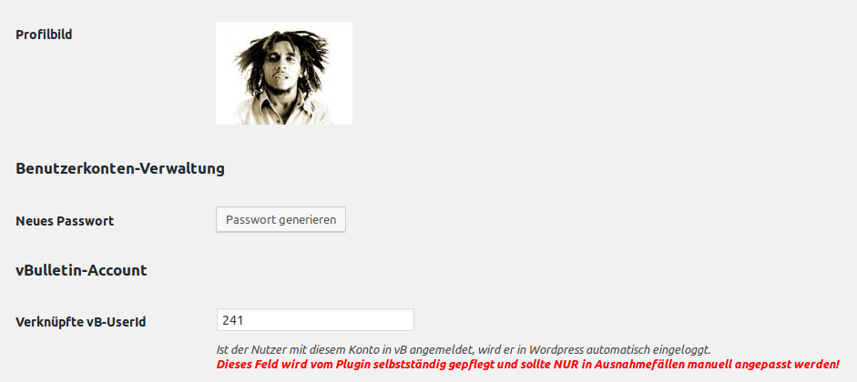

# vBulletin SSO Plugin für WordPress 
Single-Sign-On (Automatischer Login) von vBulletin 4 Benutzern in Wordpress inkl. Darstellung ihres vB-Avatars.

## Mindestanforderungen
- Wordpress >= 5.3
- vBulletin >= 4.2.5
- PHP >= 7.2
- VB und WP müssen auf der gleichen TLD betrieben werden, WP benötigt Zugriff auf die vB Sitzungscookies

## Installation
1. `ul-vbulletin-sso-for-wordpress` in das Pluginverzeichnis von Wordpress (`wwwroot/wp-content/plugins`) kopieren
2. Beispiel-Konfigurationsdatei kopieren: `cp config.example.php config.php`
3. Konfigurationsdatei öffnen (`vim config.php`) und die entsprechenden Zugangsdaten zur VB-Datenbank eintragen

Der VB Datenbankbenutzer benötigt Zugriff auf die folgenden Tabellen: 
- user
- usergroup
- session
- usergroup

## Funktionalität und Kontext
Beim Aufruf einer WP-Seite prüft das Plugin, ob eine authentifizierte vB-Sitzung besteht. Hierzu ist Zugriff auf die VB-Sitzungscookies nötig. Eine Beispielkonstellation wäre: VB unter tld.com/forum und Wordpress auf tld.com/portal oder tld.com. Wenn die Cookies von VB für tld.com gesetzt werden (nicht nur für den `/forum` Pfad), ist die SSO-Funktionalität gewährleistet.

Der Endbenutzer benötigt lediglich eine VB-Sitzung, um WP ohne händischen Login verwenden zu können. Im Hintergrund wird bei der ersten erkannten Sitzung automatisch ein WP-Benutzerkonto anhand der vB Benutzerinfo angelegt. Die Zuordnung geschieht anhand der VB Benutzer-Id. Sie wird informell in der Benutzerinfo für Administratoren/Authoren angezeigt:

Zusammengefasst bietet es folgende Funktionalitäten: 

- SSO-Funktionalität: VB-Sitzungen werden via Cookies erkannt, ggf. ein passender WP-Benutzer erstellt und dieser eingeloggt
- Login mit VB-Zugangsdaten in Wordpress
- Anzeige des VB-Avatars in WP
- Standard-Avatar, falls der Nutzer kein eigenes in VB hochgeladen hat
- Weiterleitung auf das VB-Kontrollzentrum, wenn ein VB-Benutzer seine Daten in WP ändern möchte
- Priorisierung von lokalen Benutzern (Nach einer VB-Sitzung wird nur gesucht, wenn noch kein nativer WP-Benutzer eingeloggt ist)
- Erkennung von gesperrten Nutzern

Das Plugin wurde Mitte 2017 für das U-Labs Portal entwickelt. Ziel war es, vBulletin-Benutzern Zugriff auf Wordpress zu gewähren. Sowohl zum Verfassen von Artikeln als auch für andere WP-Funktionen wie beispielsweise Kommentare.